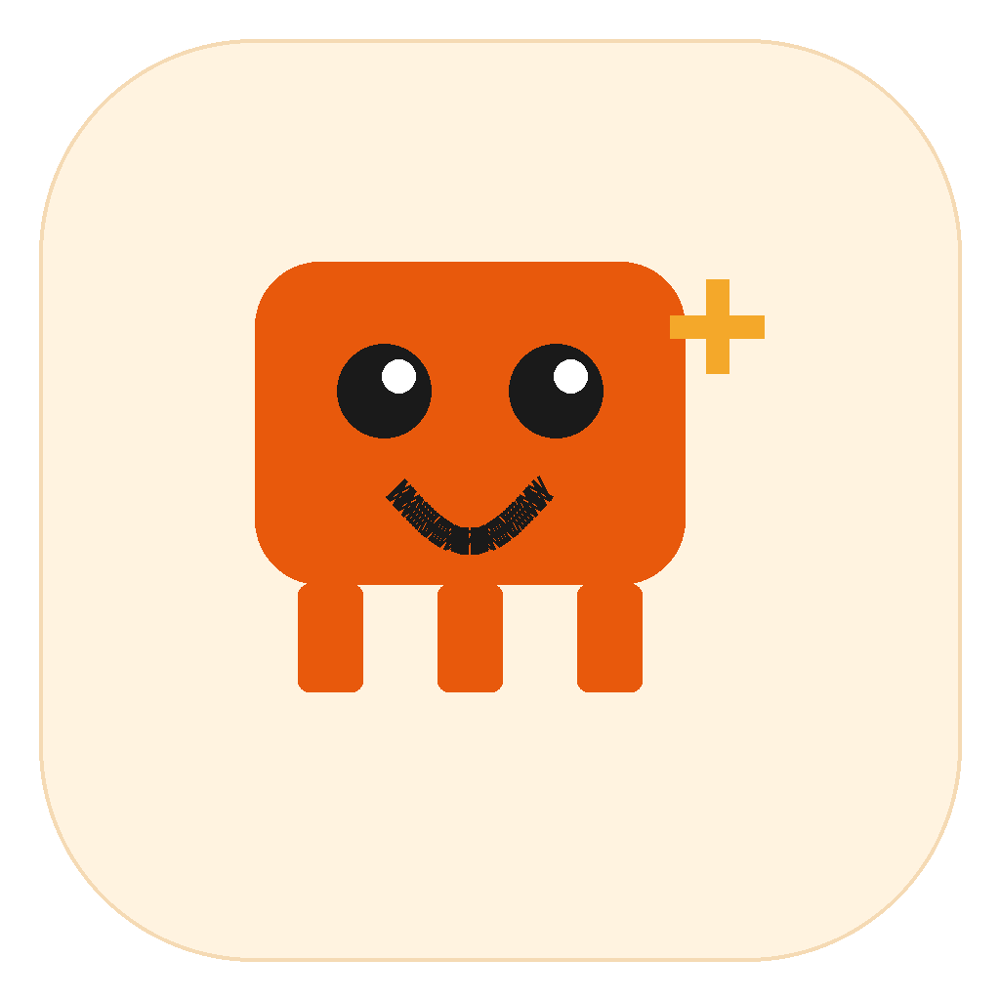
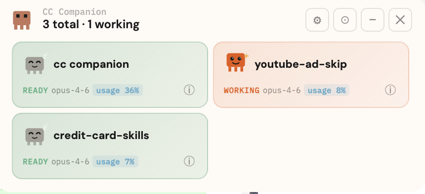

# CC Companion

<p align="center">
  
</p>

A desktop companion app that monitors your Claude Code sessions in real time. Built with Electron.

CC Companion is a lightweight always-on-top window that sits at the top of your screen, tracking every Claude Code instance running on your machine — which project it's in, whether it's actively working or idle, CPU and memory usage, token consumption, conversation turns, and how long it's been in each state.

<div align="center">

https://github.com/user-attachments/assets/df42aecd-d983-4839-9bad-8368281be0e0

</div>

<table>
  <tr>
    <td></td>
    <td></td>
    <td></td>
  </tr>
  <tr>
    <td align="center"><em>Light mode</em></td>
    <td align="center"><em>Working state</em></td>
    <td align="center"><em>Settings + detail</em></td>
  </tr>
  <tr>
    <td colspan="2"></td>
    <td></td>
  </tr>
  <tr>
    <td colspan="2" align="center"><em>Dark mode with detail panel</em></td>
    <td></td>
  </tr>
</table>

## Features

### Claude Code Instance Tracking
- Auto-detects all running Claude Code processes (filters out Claude desktop app and subagent processes)
- Per-instance tile showing project name, model, status, and context usage
- **Session analytics**: turn count, input/output token usage, context usage, model name — read directly from Claude's session files
- **Session timing**: start time (with date if not today) and total elapsed time shown in detail panel
- **Anti-flicker**: 3-second idle grace period prevents flickering between working/ready during brief pauses between tool calls
- **Smart timer reset**: timer resets when a new user turn starts, so quick back-and-forth exchanges get fresh timers
- Instances display in a 2-column grid, scrollable when more than 6 are running
- **Rename instances** — right-click any tile to give it a custom name (useful when running multiple instances in the same project folder)
- **Close instances** — right-click a tile and confirm to terminate a Claude Code session (terminal tab stays open)
- Click any instance tile to focus its terminal window
- Drag tiles to reorder them

### Session History
- **History panel** (⏳) — browse your last 50 Claude Code sessions across all projects
- Each entry shows project name, first message, turn count, and relative time
- **Resume button** — opens a new Terminal tab with `claude --resume` in the correct project directory
- Reads directly from `~/.claude/history.jsonl` — no external services

### Settings Panel
Gear button opens a floating popup with all settings (persisted across restarts):
- **Theme** — toggle between Dark and Light mode
- **Show Work Timer** — display elapsed working time on active instance tiles
- **Show Ready Timer** — display elapsed idle time on ready instance tiles
- **Opacity** — background transparency (Light 80% / Mid 90% / Full 100%) — only affects background, not text

### Instance Detail
Click the `ⓘ` button on any tile to view detailed stats:
- Session start time and total elapsed
- Model and git branch
- Context usage percentage
- Input/output/cached token counts
- CPU and memory usage
- Working directory path

### Controls
- **Settings** (⚙) — open settings panel
- **History** (⏳) — browse and resume past sessions
- **Center** (⊙) — snap the island to center-top of screen
- **Minimize** (−) — minimize to dock (native macOS animation)
- **Quit** (✕) — exit the app
- **Tooltips** — hover any button to see its function

## Getting Started

### Run from source (recommended)

```bash
git clone https://github.com/jiahongc/cc-companion.git
cd cc-companion
npm install
npm start
```

Requires [Node.js](https://nodejs.org/) v18+.

### DMG download

A pre-built DMG is available on the [Releases](https://github.com/jiahongc/cc-companion/releases) page. Since the app is unsigned, macOS will block it on first launch. After dragging to Applications, run:

```
xattr -cr /Applications/CC\ Companion.app
```

## Project Structure

```
cc-companion/
├── electron/
│   ├── main.js          # Electron main process, IPC handlers, window management
│   ├── preload.js       # Context bridge API for renderer
│   └── watcher.js       # Claude Code process detection, session analytics
├── src/
│   ├── compact.html     # Dynamic Island window
│   ├── compact.css      # Dynamic Island styles
│   └── compact.js       # Dynamic Island renderer
├── test/
│   └── watcher.test.js  # 61 tests covering detection, state, tokens, formatting
├── assets/
│   ├── icon_1024.png    # App icon (1024x1024 source)
│   ├── icon.icns        # macOS app icon
│   └── iconTemplate.png # Tray icon
└── package.json
```

## How It Works

### Process Detection
The watcher polls `ps` every 2 seconds to find Claude CLI processes (case-insensitive), filtering out the Claude desktop app, helper processes, subagent child processes, and Electron/system binaries. It resolves each process's working directory via `lsof -d cwd` to get the project name. Async instance initialization is guarded against duplicate creation during the discovery window.

**Activity detection** uses a multi-signal approach with tiered staleness:

1. **JSONL state (primary)** — reads the last entry from Claude's session JSONL to determine ground truth. Some entries are immediately idle (`end_turn`, `system`, `file-history-snapshot`). Active entries get entry-type-specific staleness thresholds:

   | Entry | Staleness | Rationale |
   |-------|-----------|-----------|
   | `assistant(null)` | 10s | Streaming is continuous; 10s silence = interrupted |
   | `assistant(tool_use)` | 5 min | Tools (builds, browser) run long without writes |
   | `progress` | 5 min | Subagents run long without writes |
   | `user` | 2 min | Claude should start responding within 2 min |
   | `queue-operation` | 30s | Quick task notifications |
   | `result` | 30s | Tool output; Claude should pick up quickly |

2. **CPU fallback** — beyond any staleness threshold, if CPU >= 5%, the instance is still treated as active. Also used when no JSONL file exists yet (brand new process).

3. **Idle grace period** — when transitioning from active to idle, the watcher waits 3 seconds (2 consecutive polls) before confirming the transition. This prevents UI flickering during brief pauses between tool calls or multi-step responses.

4. **Turn-aware timer reset** — the working timer resets when a new user turn is detected (turn count increases on idle→active transition), so quick exchanges get fresh timers instead of accumulating from the original session start.

State transitions (active → idle, idle → active) are timestamped for duration tracking.

### Session Analytics
For each detected instance, the watcher reads:
- `~/.claude/sessions/{pid}.json` — session ID and start time
- `~/.claude/projects/{project-key}/{session-id}.jsonl` — conversation log

From the JSONL it extracts:
- **Turn count** — real user prompts (excludes tool-use results)
- **Token usage** — input, output, cache read, cache creation tokens
- **Context tokens** — current context window fill (input + cache read + cache creation from last entry)
- **Model** — which Claude model is active
- **Git branch** — current branch name

Stats refresh every 5 seconds. Only emits updates when data actually changes (deduplicated via snapshot key).

## Testing

```bash
npm test          # run all 61 tests
npm run test:watch  # watch mode
```

Tests cover activity detection, state transitions, idle grace period, timer resets, session reset on /clear, model switching, token counting, snapshot deduplication, duplicate prevention, and formatting helpers.

## Build from Source

To package as a standalone `.dmg`:

```bash
npm run build:mac
```

Output goes to the `dist/` folder.

## Security & Privacy

- **Local only** — CC Companion runs entirely on your machine. No data is sent to any server, no network requests are made, no telemetry or analytics.
- **Read-only** — The app only reads Claude Code's session files (`~/.claude/sessions/`, `~/.claude/projects/`). It never writes to them or modifies your Claude sessions in any way.
- **No secrets** — The app does not access, store, or transmit API keys, tokens, or credentials. It reads process metadata (`ps`) and session JSONL files, which contain conversation structure but not your API keys.
- **Process isolation** — Electron runs with `contextIsolation: true` and `nodeIntegration: false`. The renderer communicates with the main process only through a restricted preload API.
- **Open source** — Run from source so you can verify the code yourself before running it.

## Contributing

1. Fork this repo
2. Create a feature branch (`git checkout -b feature/my-feature`)
3. Commit your changes (`git commit -am 'Add my feature'`)
4. Push to the branch (`git push origin feature/my-feature`)
5. Open a Pull Request

## License

MIT
